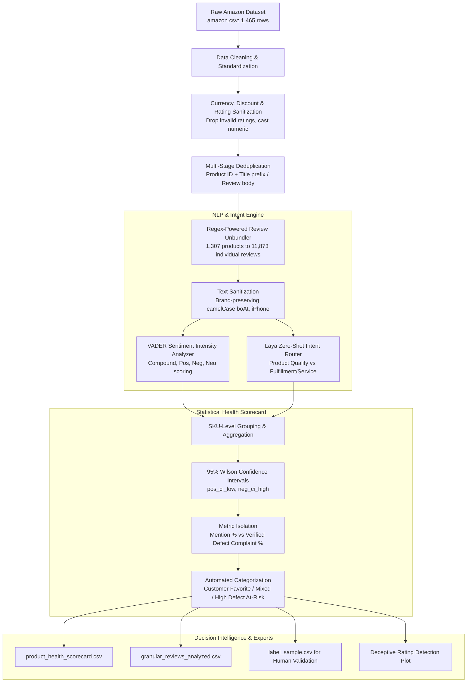

# 🛍️ E-Commerce Customer Review Intelligence & Defect Root-Cause Engine

[](https://www.python.org/)
[](https://pandas.pydata.org/)
[](https://www.nltk.org/)
[](https://github.com/)
[](https://opensource.org/licenses/MIT)

> An end-to-end NLP and data engineering pipeline that unpacks bundled Amazon e-commerce reviews, disentangles **Product Quality Defects** from **Logistics / Fulfillment Failures**, and calculates statistically sound **Product Health Scorecards** with 95% Wilson confidence intervals to identify deceptively rated items.

---

## 📌 Executive Summary & Key Metrics

E-commerce star ratings often create a dangerous blind spot: products with aggregate 4.0+ star ratings frequently conceal critical hardware failures or fulfillment breakdowns within customer review text. 

This project transforms raw, bundled review records into an actionable intelligence system:
- **1,465 Raw Product Listings** parsed, sanitized, and deduplicated across **9 main product categories**.
- **11,873 Granular Reviews Unbundled** from concatenated catalog strings using custom regex lookahead splitting without sentence truncation.
- **Dual NLP Classification Engine**: Lexical sentiment analysis (**VADER**) combined with zero-shot semantic intent routing (**Laya Router**) to categorize feedback into **Product** vs. **Service**.
- **Wilson Confidence Bounds (95% CI)** applied to overcome small-sample review bias per SKU (averaging ~9.1 reviews/product).
- **Automated Root-Cause Attribution**: Quantifies exact defect drivers to pinpoint whether third-party manufacturers or delivery partners are responsible for customer dissatisfaction.

```
┌─────────────────────────┐   ┌─────────────────────────┐   ┌─────────────────────────┐
│     1,307 Clean SKUs    │   │  11,873 Exploded Revs   │   │   Wilson 95% CI Logic   │
│  Deduped & Preprocessed │ → │ 81.4% Pos | 10.3% Neg   │ → │ Prevents False Positives│
│  9 E-Commerce Categories│   │  8.3% Neutral (VADER)   │   │  in Small-Sample SKUs   │
└─────────────────────────┘   └─────────────────────────┘   └─────────────────────────┘
```

---

## 💼 Business Problem & Motivation

1. **Star Ratings Mask Operational Defects**: A product displaying a 4.1-star rating may look healthy at a glance, but recent batches could suffer from catastrophic wire fraying, software bugs, or packaging damage that aggregate stars fail to reflect immediately.
2. **Ambiguity in Responsibility**: When an e-commerce platform or seller receives a negative review, is the defect attributable to **product build/hardware** (seller/vendor issue) or **delivery/packaging** (logistics partner issue)?
3. **The Small-Sample Bias Problem**: When aggregating per-product customer sentiment where each SKU averages under 10 reviews, a single review swings percentage metrics by over 10%. Naive ranking yields erratic, untrustworthy recommendations.

This engine solves all three challenges by providing granular review extraction, semantic intent disentanglement, and statistical defect scoring.

---

## 🏗️ System Architecture & Pipeline



---

## 🔬 Core Engineering Challenges & Solutions

### 1. Regex Lookahead Unbundling for Concatenated Reviews
* **Challenge**: Amazon catalog data frequently bundles all customer reviews for an item into a single comma-delimited cell. Splitting naively on commas fractures sentences containing commas (e.g., *"Good cable, but broke after two weeks, highly disappointed"*).
* **Engineering Solution**: Developed a lookahead regex splitter `re.split(r',\s*(?=[A-Z0-9"\'\-])', content)` coupled with `review_id` count alignment checks. This safely identifies true review boundaries without cutting intra-review descriptive clauses, cleanly expanding 1,307 products into **11,873 traceable individual reviews**.

### 2. Brand-Preserving CamelCase Cleansing
* **Challenge**: Extracted raw text contained concatenated words from HTML/scraping artifacts (e.g., `fastCharging`). A standard camelCase regex regex splits `([a-z])([A-Z])`, which corrupts well-known technology brand names (e.g., `iPhone` becomes `i Phone`, `boAt` becomes `bo At`, `OnePlus` becomes `One Plus`).
* **Engineering Solution**: Implemented a token-masking dictionary safeguarding brand names with placeholders (`__BRAND_iPhone__`) before applying regex spacing transforms and safely restoring them post-sanitization.

### 3. Disentangling "Mentions" from "Defect Complaints"
* **Challenge**: Simply counting how often "Service" or "Delivery" appears inflates defect metrics, as many customers leave positive logistical comments (e.g., *"Lightning fast 1-day delivery!"*).
* **Engineering Solution**: Isolated **Topic Intent** from **Polarity**. Built distinct operational metrics:
  - `service_mention_pct`: Total logistics focus.
  - `service_complaint_pct`: Specifically **Service Intent AND Negative Sentiment** (`Comp Score <= -0.05`).
  - `product_complaint_pct`: Specifically **Product Intent AND Negative Sentiment**.
  This guarantees that supply chain teams are only alerted to genuine delivery failures rather than praise.

### 4. Overcoming Small-Sample Distortion via Wilson Score Intervals
* **Challenge**: SKUs in catalog datasets have varying review depth (some have 4 reviews, others have 20+). A product with 3 positive reviews out of 3 (100%) should not outrank a product with 18 positive reviews out of 20 (90%).
* **Engineering Solution**: Incorporated the **95% Wilson Score Confidence Interval**:
  $$\text{Score} = \frac{p + \frac{z^2}{2n} \pm z \sqrt{\frac{p(1-p)}{n} + \frac{z^2}{4n^2}}}{1 + \frac{z^2}{n}}$$
  By enforcing `pos_ci_low >= 50.0%`, `negative_pct <= 10.0%`, and a hard threshold of `MIN_REVIEWS = 5`, the engine prevents volatile small-sample artifacts from falsely classifying unproven products as "Customer Favorites."

---

## 📊 Key Findings & Analytical Highlights

### 1. Sentiment & Intent Breakdown
* **Lexical Sentiment (VADER on 11,873 reviews)**:
  - **Positive**: 81.4% (9,662 reviews)
  - **Negative**: 10.3% (1,220 reviews)
  - **Neutral**: 8.3% (991 reviews)
* **Intent Cross-Tabulation**: Customer feedback was split into Product Quality vs. Logistical Service, revealing that while product quality complaints dominate in volume, fulfillment failures have a disproportionately higher share of intense negative polarity.

### 2. Uncovering "Deceptively Rated" Products
By cross-plotting Amazon displayed Star Ratings against computed text **Net Sentiment Scores** $(\% \text{Positive} - \% \text{Negative})$:
* Discovered clusters of products boasting 4.0 to 4.3 star ratings that exhibit negative net text sentiment (sub-zero score), indicating recent quality drops, unaddressed hardware bugs, or batch manufacturing failures.
* Flagged at-risk SKUs and prioritized them directly into `product_health_scorecard.csv`.

### 3. Category Failure Profiles
* **Electronics & Accessories**: Driven primarily by hardware durability defects (frayed charging cables, battery drainage, audio desync).
* **Home & Kitchen / Appliances**: Exhibited elevated proportions of fulfillment and packaging damage complaints.

---

## 📁 Repository Structure

```plaintext
├── Customer_review_analysis.ipynb   # Main end-to-end data pipeline, modeling & scorecard notebook
├── amazon.csv                       # Raw e-commerce sales dataset (1,465 items)
├── product_health_scorecard.csv     # Output: SKU-level health scorecard with Wilson bounds
├── granular_reviews_analyzed.csv    # Output: 11,873 unbundled reviews with sentiment & intent
├── label_sample.csv                 # Output: Stratified evaluation sample for human audit
├── implementation_plan.md           # Engineering implementation blueprint & specifications
├── system_architecture.md           # System architecture design documentation
├── review_analysis_changes.md       # Audit trail of methodological refinements
└── README.md                        # Project documentation & business overview
```

---

## 🛠️ Data Deliverables & Output Schema

### `product_health_scorecard.csv` (Aggregated SKU Health)
| Column Name | Description | Example |
|---|---|---|
| `product_id` | Unique Amazon ASIN identifier | `B07JW9H4J1` |
| `product_name` | Cleaned product title | `Wayona Nylon Braided USB Cable...` |
| `star_rating` | Catalog displayed star rating | `4.2` |
| `total_reviews` | Exploded review sample analyzed | `8` |
| `positive_pct` | Percentage of positive reviews | `87.5%` |
| `pos_ci_low` | 95% Wilson Confidence lower bound | `52.9%` |
| `net_sentiment_score` | Net Sentiment (% Pos - % Neg) | `+75.0` |
| `service_complaint_pct` | Logistical negative complaint rate | `0.0%` |
| `product_complaint_pct` | Hardware/quality negative complaint rate | `12.5%` |
| `product_health` | Categorical health status | `Customer Favorite` |
| `primary_bottleneck` | Primary root-cause bottleneck | `Healthy / Low Defect Rate` |

---

## 🚀 Quickstart & Reproduction Guide

### Prerequisites
- Python 3.10 or higher
- Jupyter Notebook or VS Code Jupyter Extension

### 1. Clone the Repository
```bash
git clone https://github.com/vansh-ika123/customer-review-analysis.git
cd customer-review-analysis
```

### 2. Install Dependencies
```bash
pip install pandas numpy matplotlib seaborn nltk tqdm laya
```

### 3. Run the Pipeline
Open [Customer_review_analysis.ipynb](Customer_review_analysis.ipynb) in your preferred environment:
```bash
jupyter notebook Customer_review_analysis.ipynb
```
Run all cells sequentially to:
1. Load and clean [amazon.csv](amazon.csv).
2. Execute regex unbundling and text sanitization.
3. Compute VADER sentiment and Laya intent routing.
4. Calculate Wilson score confidence bounds and generate diagnostic CSV exports.

---

## 🎯 Resume Bullet Points & Interview Guide

If you are showcasing this project on your resume or preparing for technical interviews, use these impact-oriented bullet points:

### 💼 For Your Resume
* **Data Scientist / NLP Engineer**:
  > *"Architected an automated customer review intelligence pipeline in Python, extracting and unbundling 11,800+ granular reviews across 1,300+ e-commerce SKUs using custom regex lookahead parsers."*
* **Machine Learning & Analytics**:
  > *"Engineered a dual NLP classification system combining VADER sentiment analysis and zero-shot intent routing to disentangle product manufacturing defects from 3PL logistics failures."*
* **Statistical Rigor & Business Impact**:
  > *"Mitigated small-sample ranking bias across low-review SKUs using 95% Wilson Confidence Intervals, pinpointing deceptively rated products (4.0+ star rating with negative net text sentiment) to prioritize quality assurance interventions."*

### 🎙️ Common Interview Talking Points
1. **How did you handle messy real-world text data?**
   * *Answer*: Discuss the comma lookahead unbundling challenge, handling non-standard currency symbols (`₹`), erratic catalog rating strings (`|`), and preserving brand casing (`boAt`, `iPhone`) during camelCase normalization.
2. **Why use Wilson Confidence Intervals instead of standard percentages?**
   * *Answer*: Discuss the law of small numbers—a SKU with 2 positive reviews out of 2 has a naive 100% positive rate, but extreme uncertainty. Wilson lower bounds mathematically reflect sample size confidence.
3. **How does this system provide operational value to an e-commerce business?**
   * *Answer*: By isolating `service_complaint_pct` from `product_complaint_pct`, operations leadership can immediately route defective SKUs to either supplier quality management (hardware redesign) or fulfillment partners (packaging re-evaluation).

---

## 📜 License
Distributed under the MIT License. See `LICENSE` for more information.
