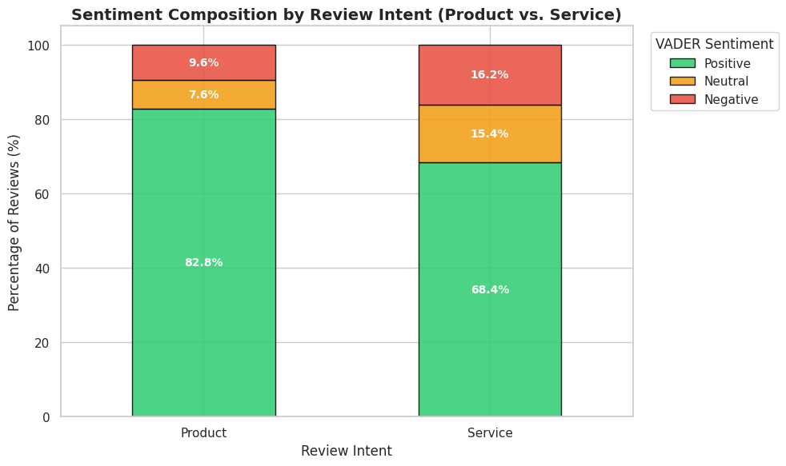
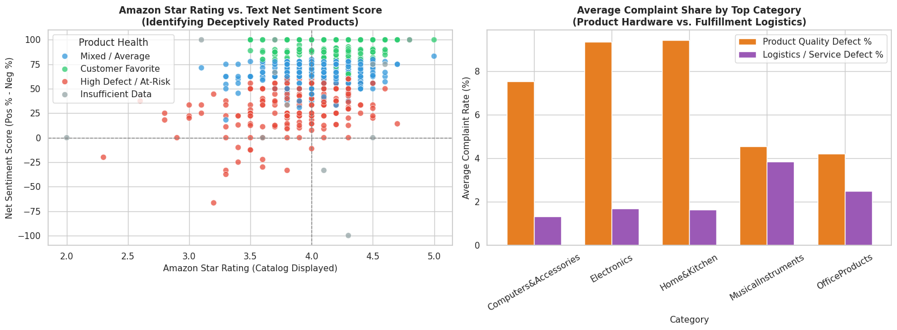

# Amazon India Customer Review Analysis

[](https://www.python.org/)
[](https://pandas.pydata.org/)
[](https://www.nltk.org/)
[](https://pypi.org/project/laya/)

Sentiment and intent analysis of 11,873 Amazon India customer reviews, used to separate **product problems** from **service problems** and flag at-risk products.

## Business Problem
On Amazon, products are sold by third-party sellers while delivery and service are handled by Amazon. A low rating alone doesn't show who should fix the problem. This project analyzes customer reviews to understand how customers feel about products and to separate product problems (seller side) from service problems (delivery and fulfillment), so improvement efforts can be focused in the right place.

## Dataset
Amazon Sales Dataset (Kaggle). After cleaning: **1,307 products** and **11,873 individual reviews**.

## Approach
1. **Clean:** removed missing values, duplicate products and variant listings, and fixed price, discount and rating formats
2. **Unbundle:** split bundled review text into individual reviews
3. **Sentiment:** scored every review with VADER (Positive / Neutral / Negative)
4. **Intent:** classified each review as Product or Service using Laya (zero-shot)
5. **Scorecard:** built a product health scorecard using Wilson 95% confidence intervals to handle small review counts

## Key Findings
- **Customers are largely satisfied:** 81.4% of reviews are positive and only 10.3% are negative.
- **Star ratings hide detail:** 76% of products sit between 3.9 and 4.4 stars, so the rating alone barely separates strong products from weak ones.
- **Product quality is the main problem, not delivery:** 216 products are flagged for product quality defects versus only 17 for logistics issues, roughly a 13 to 1 ratio.
- **Service reviews are less positive than product reviews:** 68.4% positive versus 82.8%, though service makes up only 10% of all reviews.
- **19% of products need attention:** 252 products are at-risk, 509 are mixed, and 533 are customer favorites.
- **Recommendation:** focus first on seller and product quality control, with fulfillment as a secondary priority.






## Tech Stack
Python, pandas, NumPy, NLTK (VADER), Laya, matplotlib, seaborn

## Output Files
- `product_health_scorecard.csv`: product-level scorecard with confidence intervals and bottleneck classifications
- `granular_reviews_analyzed.csv`: 11,873 individual reviews with sentiment scores and intent tags
- `label_sample.csv`: sample of 150 reviews exported for manual verification

## How to Run
1. Install dependencies:
   ```bash
   pip install pandas numpy matplotlib seaborn nltk tqdm laya
   ```
2. Place `amazon.csv` in the project folder.
3. Open and run the notebook:
   ```bash
   jupyter notebook Customer_review_analysis.ipynb
   ```